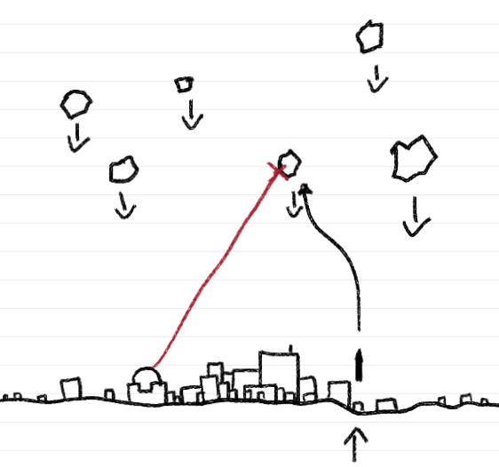

# Possívelmente um projeto de OOP?

- `make`: Compila os arquivos-fonte da pasta `/src`, gera os objetos necessários e vincula, criando o executável `/bin/seeker`.
- `make test`: Compila os arquivo-fonte da pasta `/test`, sem gerar seus objetos, criando um executável em `/bin` para cada.
- `make clean`: Remove todos os objetos (`.o`) da pasta `/build` e binários executáveis da pasta `/bin`.
- `make run:` Executa o binário `/bin/seeker`.

<figure>
    
    <figcaption>Conceito?</figcaption>
</figure>

## To-Do:
1. Ray casting (para o laser ter colisão e guiar os misseis)
2. Método para intersecção linha-círculo (meteoros)
3. Uma maneira mais sana de popular a lista de objetos a serem desenhados
4. Fazer o jogo em si.
